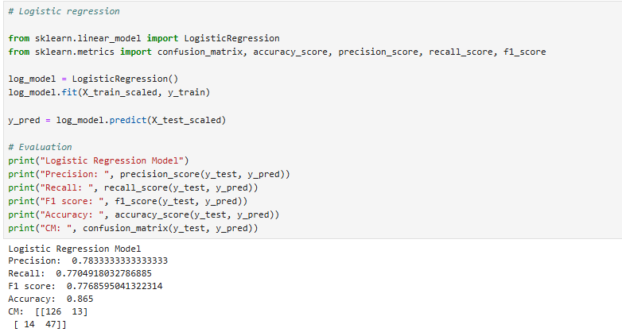

# CreditWise – Loan Approval Prediction System

## 📌 Project Overview
CreditWise is an end-to-end supervised machine learning project designed to predict loan approval outcomes based on applicant financial and demographic data.

The project demonstrates a complete data science workflow including data preprocessing, feature engineering, model training, and evaluation using industry-standard metrics.

---

## 🧠 Problem Statement
Financial institutions face challenges in accurately assessing loan eligibility, leading to increased risk and delayed decisions.  
This project aims to build a predictive model that assists in identifying whether a loan application should be approved or rejected.

---

## 🔧 Tech Stack
- Python
- Pandas, NumPy
- Scikit-learn
- Matplotlib, Seaborn

---

## 🛠️ ML Pipeline
- Data Cleaning & Preprocessing  
- Exploratory Data Analysis (EDA)  
- Feature Engineering & Scaling  
- Model Training (Logistic Regression, KNN, Naive Bayes)  
- Model Evaluation (Accuracy, Precision, Recall, F1-score)

---

## 📊 Results
The models were evaluated using classification metrics with a focus on Precision and Recall to minimize incorrect loan approvals.

---

## 🚀 Future Improvements
- Handle class imbalance using advanced techniques  
- Hyperparameter tuning  
- Model deployment using Streamlit  

---

## 📂 Repository Structure
---

## 📊 Model Evaluation

Final model: **Logistic Regression**

The Logistic Regression model was selected as the final model due to its balanced precision and recall, which is critical for loan approval decisions.

